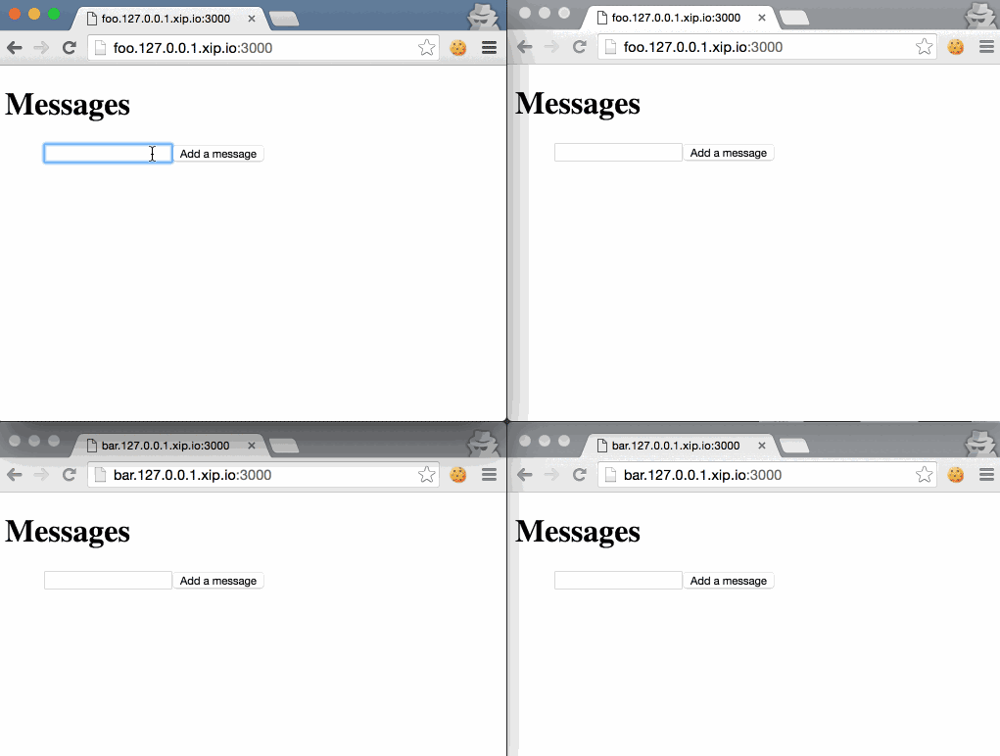

feathers-demo
=============

This is a plain NodeJS project experimenting with [feathers.js](http://feathersjs.com/) technology.

In this experiment I explore:
- [x] Multitenant application architecture in Feathers
- [ ] Realtime one-to-many resources

Getting started
---------------

```
npm install
npm start
```

Multitenant Experiment
----------------------



- Open four browser windows:
  - 2 at [http://foo.127.0.0.1.xip.io:3000/](http://foo.127.0.0.1.xip.io:3000/)
  - 2 at [http://bar.127.0.0.1.xip.io:3000/](http://bar.127.0.0.1.xip.io:3000/)

- Create a message in one of the `foo` windows. 
  - Observe the realtime reactivity in both `foo` tabs, but the message isn't present in the `bar` windows.
- Create a message in one of the `bar` windows. 
  - The second `bar` window has the message, and neither `foo` tab has the message.
